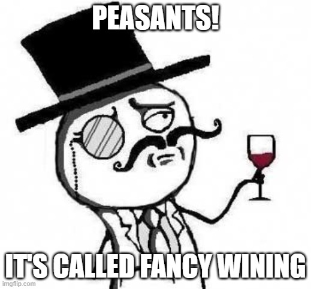

# Fine Wining

---
## Team Members
 1. Austin Rodriguez
 2. Rochelle Williams
 3. Gregg Saldutti
 4. Daniel Budhram

--- 
# Project Outline
**Running multiple classifications and deep learning models on red and white wine datasets to predict quality.**

*“Accept what life offers you and try to drink from every cup. All wines should be tasted; some should only be sipped, but with others, use them for data studying with machine learning.” -Paulo Coelho with add inspiration from us*

---
## Datasets
Red and White Wine Datasets from a study down by the University of California, Irvine which were found on Kaggle. 

---
## Citations
[Srija Neogi Medium](https://medium.com/@srijaneogi31/predict-your-wine-quality-using-deep-learning-with-pytorch-424d736f0880)

[PyTorch Documentation](https://pytorch.org/docs/stable/index.html)

[Nandan Pandey Blog](https://blog.jovian.ai/get-best-quality-red-wine-using-pytorch-and-ml-1ab2fa554bcf)

[Ali Faghihnejad Wine Classification](https://towardsdatascience.com/wine-data-set-a-classification-problem-983efb3676c9)

[TWhipple Wine Classification](https://github.com/twhipple/Wine_Classification/blob/master/Wine_Quality_Notebook.ipynb)

[Christopher Liew Red Wine Classifier](https://github.com/ChristopherLiew/Building-A-Generalisable-Red-Wine-Quality-Classifier)

[Jingyi Wine Quality Prediction](https://github.com/Jingyi0321/Wine-Quality-Prediction-Project-Classification-Models/blob/main/ML_project.ipynb)

[Samseer Predicting Wine Quality](https://github.com/Sameersri236/Predicting-wine-quality/blob/main/MiniProject(wine%20quality).ipynb)

---

